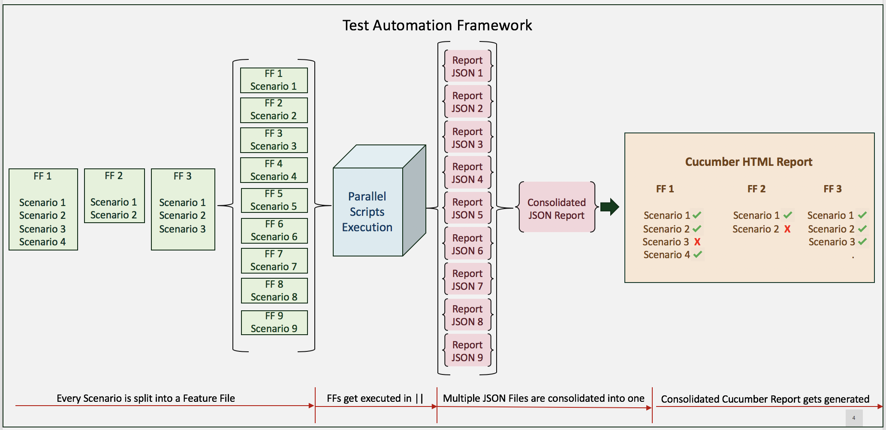

# wdio-cucumber-parallel-execution

A WebdriverIO capability for running **Cucumber** scenarios in parallel.

The capability Segregates the entire Automation Suite into smallest independent chunks (Scenarios) and spawns numerous threads through WebdriverIOs maxInstances feature,thus reducing the Test Execution time drastically and allowing Teams to release much faster.

The Solution is Compatible with multiple versions of Nodejs (Ones supporting Async Await natively as well as ones which do not support it)

Handles merging of reports out of the box and provides a consolidated JSON Report Array, which can be leveraged for Reporting.


# Installation

```
npm install wdio-cucumber-parallel-execution
```

# Architectural View



Assuming 1 Scenario takes 1 minute on Average, Total Execution Time will be 1 minute for 9 Scenarios since  all 9 Scenarios will get executed in parallel

# API


The Module contains the following functions:


### performSetup

This Feature Creates/Removes the Spec and Temp Folders and puts every Scenario in a seperate Feature File


| Parameter                        | Type   | Details                                                                                         |
|----------------------------------|--------|-------------------------------------------------------------------------------------------------|
| sourceSpecDirectory              | string | glob expression for sourceSpecDirectory                                                         |
| tmpSpecDirectory                 | string | Path to temp folder containing the Temporary Feature Files (Gets removed in the next execution) |
| tagExpression (optional)         | string | Tag expression to parse                                                                         |
| ff (optional)                    | string | Feature File Name to parse                                                                      |
| lang (optional)                  | string | Language of sourceSpecDirectory                                                                 |
| cleanTmpSpecDirectory            | Boolean| Boolean for cleaning the Temp Spec Directory                                                    |


### getConsolidatedArray


This Feature clubs the JSON Objects generated by every splitted Feature File and returns a consolidated JSON Array, which can be used for Reporting.

| Parameter                        | Type   | Details                                                                         |
|----------------------------------|--------|---------------------------------------------------------------------------------|
| parallelExecutionReportDirectory | string | Path to Parallel Execution Report Directory where all the Reports will be saved |


# Usage

### Setup

```

const wdioParallel = require('wdio-cucumber-parallel-execution');

wdioParallel.performSetup({
    sourceSpecDirectory: sourceSpecDirectory,
    tmpSpecDirectory: tmpSpecDirectory,
    tagExpression: argv.tags,
    ff: argv.ff,
    lang: 'en',
    cleanTmpSpecDirectory: true
});


```

### Get Consolidated JSON Report Array

```

const wdioParallel = require('wdio-cucumber-parallel-execution');

let consolidatedJsonArray = wdioParallel.getConsolidatedData({
    parallelExecutionReportDirectory: parallelExecutionReportDirectory
});

```


# License

(The MIT License)

Copyright (c) 2019 Simit Tomar simittomar8@gmail.com

Permission is hereby granted, free of charge, to any person obtaining a copy of this software and associated documentation files (the "Software"), to deal in the Software without restriction, including without limitation the rights to use, copy, modify, merge, publish, distribute, sublicense, and/or sell copies of the Software, and to permit persons to whom the Software is furnished to do so, subject to the following conditions:

The above copyright notice and this permission notice shall be included in all copies or substantial portions of the Software.

THE SOFTWARE IS PROVIDED "AS IS", WITHOUT WARRANTY OF ANY KIND, EXPRESS OR IMPLIED, INCLUDING BUT NOT LIMITED TO THE WARRANTIES OF MERCHANTABILITY, FITNESS FOR A PARTICULAR PURPOSE AND NONINFRINGEMENT. IN NO EVENT SHALL THE AUTHORS OR COPYRIGHT HOLDERS BE LIABLE FOR ANY CLAIM, DAMAGES OR OTHER LIABILITY, WHETHER IN AN ACTION OF CONTRACT, TORT OR OTHERWISE, ARISING FROM, OUT OF OR IN CONNECTION WITH THE SOFTWARE OR THE USE OR OTHER DEALINGS IN THE SOFTWARE.


Copyright (c) 2019 Alexander Galichenko

Permission is hereby granted, free of charge, to any person obtaining a copy of this software and associated documentation files (the "Software"), to deal in the Software without restriction, including without limitation the rights to use, copy, modify, merge, publish, distribute, sublicense, and/or sell copies of the Software, and to permit persons to whom the Software is furnished to do so, subject to the following conditions:

The above copyright notice and this permission notice shall be included in all copies or substantial portions of the Software.

THE SOFTWARE IS PROVIDED "AS IS", WITHOUT WARRANTY OF ANY KIND, EXPRESS OR IMPLIED, INCLUDING BUT NOT LIMITED TO THE WARRANTIES OF MERCHANTABILITY, FITNESS FOR A PARTICULAR PURPOSE AND NONINFRINGEMENT. IN NO EVENT SHALL THE AUTHORS OR COPYRIGHT HOLDERS BE LIABLE FOR ANY CLAIM, DAMAGES OR OTHER LIABILITY, WHETHER IN AN ACTION OF CONTRACT, TORT OR OTHERWISE, ARISING FROM, OUT OF OR IN CONNECTION WITH THE SOFTWARE OR THE USE OR OTHER DEALINGS IN THE SOFTWARE.

